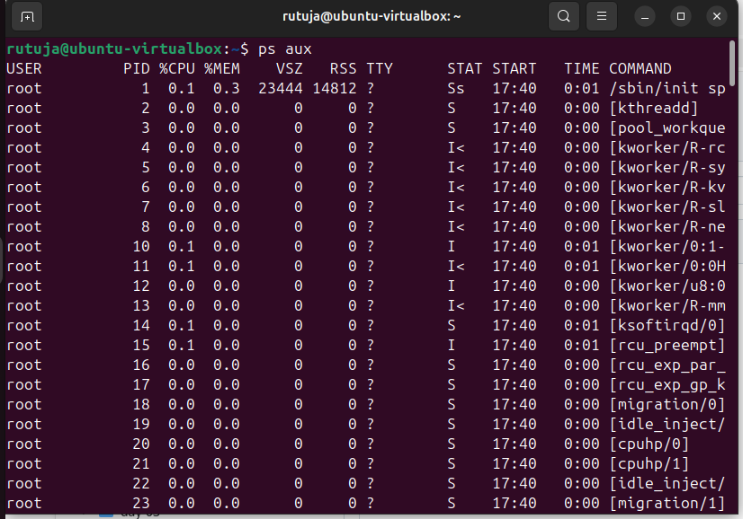
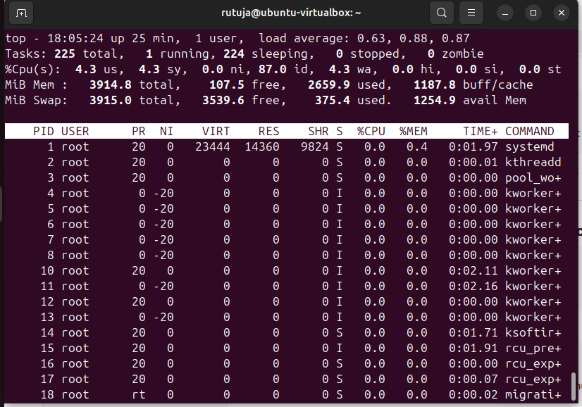
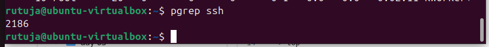
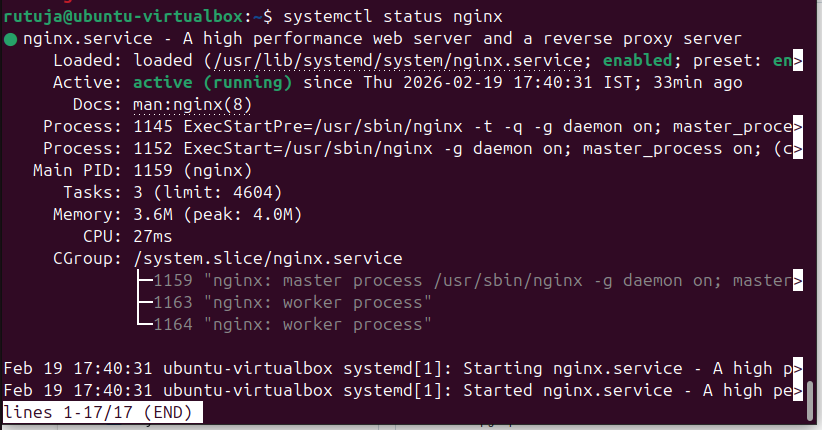
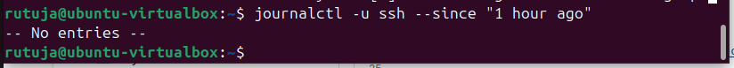

# Task 4 - Linux Practice: Processes and Services

# Process Checks

1. Check all running processes -

-> ps aux -
## Process Output

2. Check interactive processes using top -

-> top
## Process Output

3. Find process ID of ssh service -

-> pgrep ssh -
## Process Output

# Service Checks

1. Check service status -

->systemctl status nginx
# Service Output

# Log Checks
1. Check logs of ssh service -
-> journalctl -u ssh --since "1 hour ago"

# log Output

# Mini Troubleshooting Flow -

senario - nginx service is not running

1. check status -
     -> systemctl status nginx
2. Start the service -
     -> systemctl start nginx

